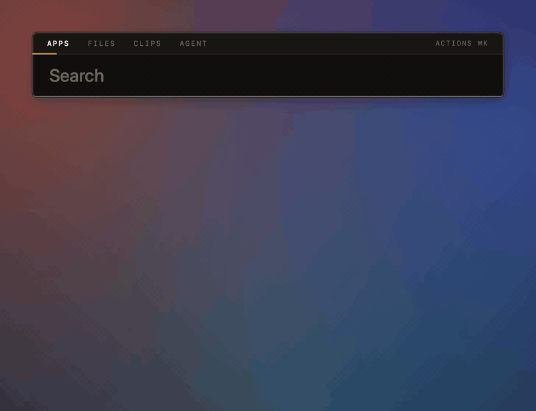
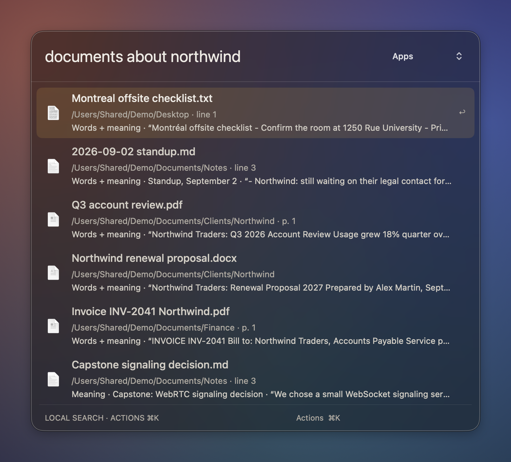
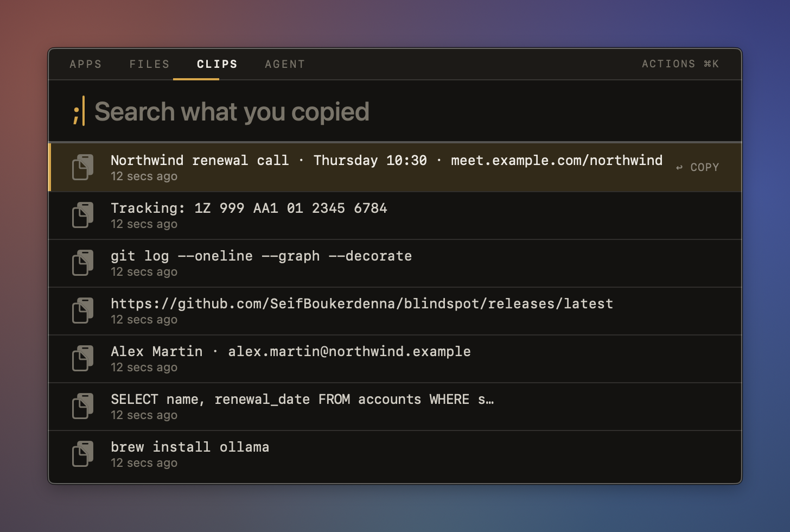
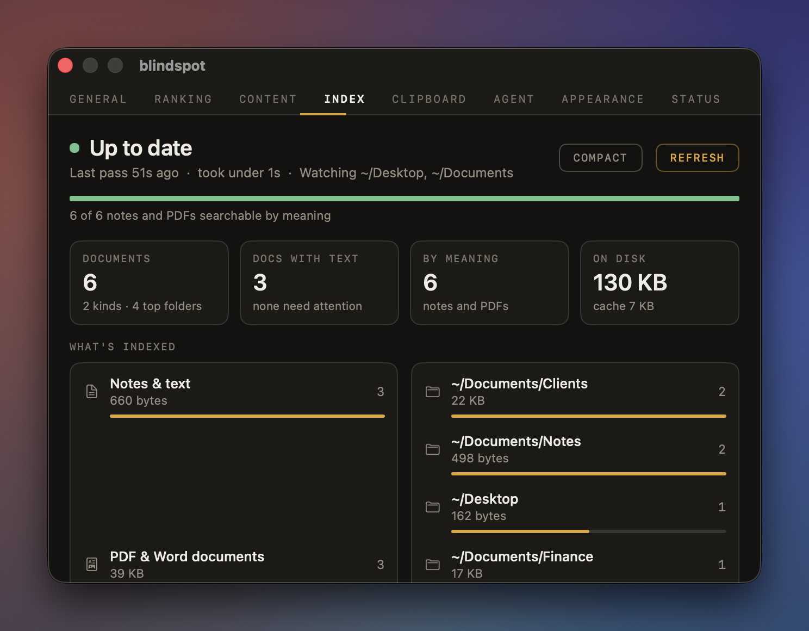
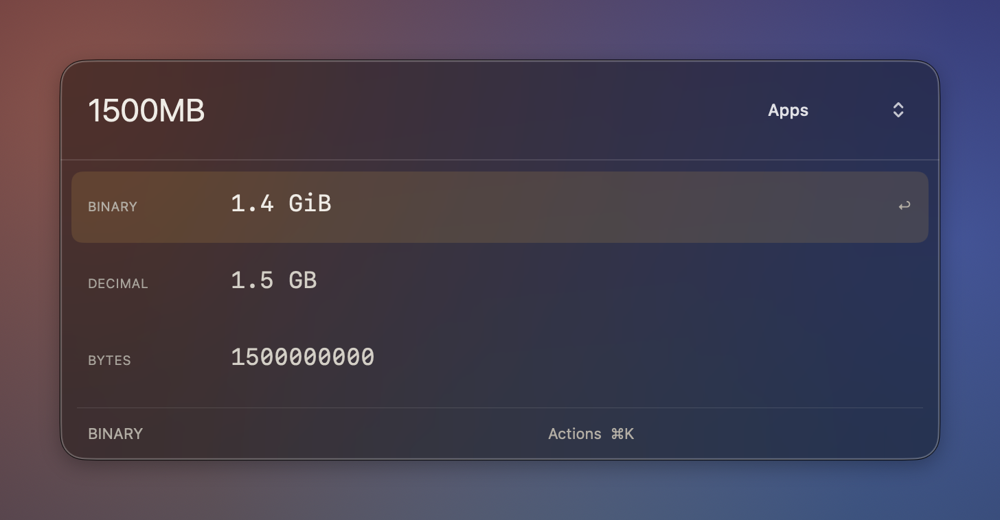
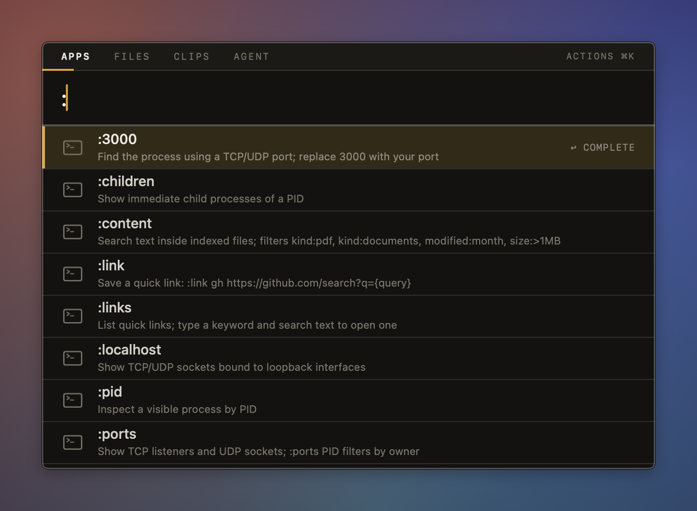
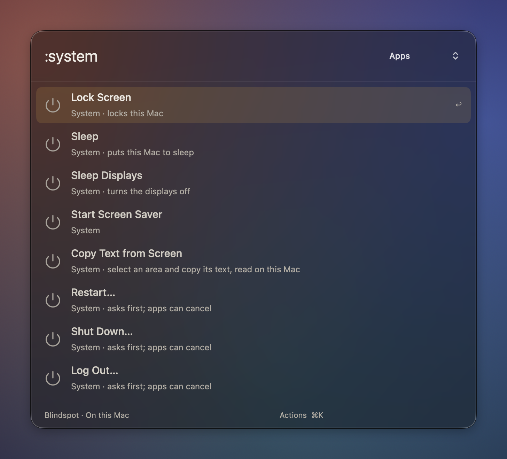
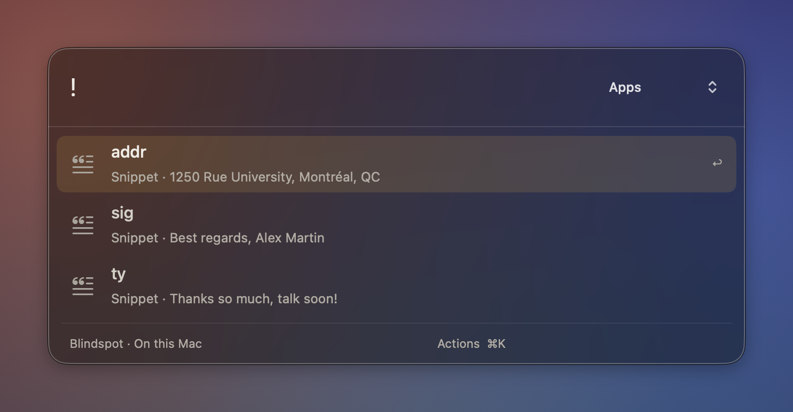
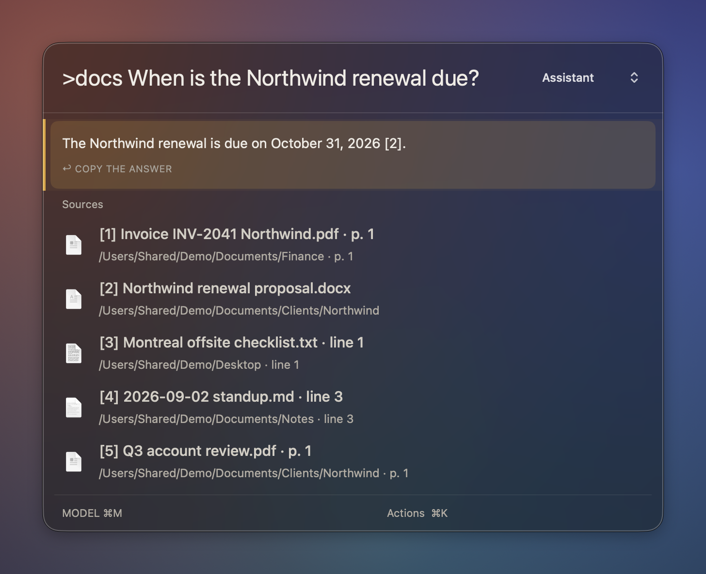
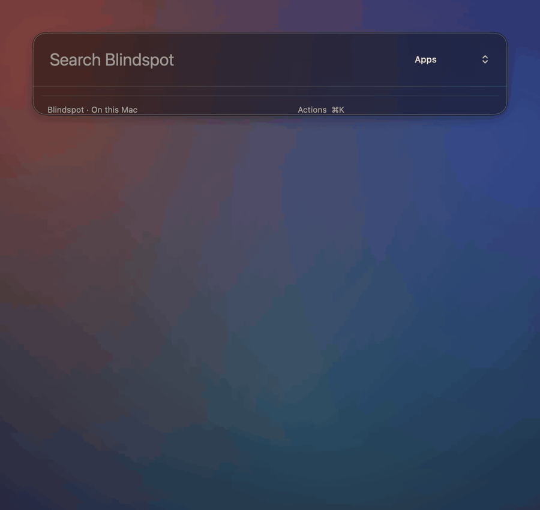

# Blindspot

**A keyboard launcher for your Mac that also finds what's inside your files, and keeps everything on your Mac.**

Press **⌘⇧Space**, type a few letters, press **Return**. Open apps, find a PDF by what it says,
paste something you copied an hour ago, join your next meeting, or ask your own documents a
question. Nothing is sent to the cloud.

[](https://github.com/SeifBoukerdenna/blindspot/actions/workflows/ci.yml)

## Download

1. Get **Blindspot-x.y.z.zip** from the [latest release](https://github.com/SeifBoukerdenna/blindspot/releases/latest).
2. Unzip it and drag **Blindspot.app** into your Applications folder.
3. Open it. The first time, macOS will say it can't verify the app, because Blindspot isn't
   notarized by Apple. Go to **System Settings → Privacy & Security**, scroll down and click
   **Open Anyway**. You only do this once.

Blindspot needs **macOS 26 (Tahoe) or later on an Apple silicon Mac**. There's no Dock icon:
press **⌘⇧Space** to open it.

### Updating

Open **Settings → Status → Updates** and press **Check for updates**. If there's a newer release,
press **Install**. Blindspot downloads it, checks its checksum and code signature, asks, then
replaces itself and reopens. Your settings, clipboard history and index stay as they are. Blindspot
only contacts GitHub when you press the button.

## What you can do

| Type this | And you get |
|---|---|
| `sl` | Slack, or whatever app you meant. Apps you use often rise to the top |
| `?quarterly report` | Files by name. **⌘Return** shows the file in Finder |
| `documents about genetec` | Notes, PDFs and Word files that *mention* Genetec, with the matching sentence |
| `>docs what did we decide about signaling?` | An answer from your own documents, with sources you can open |
| `;tracking` | Something you copied earlier, from your clipboard history |
| `fix grammar` | Select text anywhere first, and it comes back corrected (also `make shorter`, `bullet points`…) |
| `my schedule` | Today's and tomorrow's events. Press Return on one to join its Zoom, Meet or Teams call |
| `lock`, `sleep`, `dark mode`, `empty trash` | Control your Mac. Anything destructive asks first |
| `:3000` | What's using port 3000, and a safe way to stop it |
| `15% * 89`, `150 lbs`, `uuid` | Quick maths, unit conversions and developer utilities |
| `!sig` | Paste a snippet you saved with `:snippet sig Best regards…` |

Type **:** to see every command. **⌘K** shows more actions for any result, **⌘Y** previews a
file, and **⌘,** opens Settings.

The full guide with real examples ships inside the download as **START-HERE.md**. You can also read
it here: [docs/new-features.md](docs/new-features.md).

## Media

See Blindspot in action: app search, document search, conversions and clipboard history,
all from the keyboard. These captures use fictional demo documents and clipboard entries.



### Screenshots

Click a screenshot to view it at full size. For still images without animation, open the
[media gallery](media/README.md#screenshots).

| Search inside documents | Clipboard history |
|---|---|
| [](media/search-inside-documents.png) | [](media/clipboard-history.png) |
| **Index dashboard** | **Calculator and conversions** |
| [](media/index-dashboard.png) | [](media/calculator.png) |
| **Command catalog** | **System commands** |
| [](media/commands.png) | [](media/system-commands.png) |
| **Saved snippets** | **Ask your documents** |
| [](media/snippets.png) | [](media/ask-your-documents.png) |

The document question is answered by a local model from the demo documents, with the numbered
sources it drew on. Dashboard counts describe the small demo fixture.

<details>
<summary>Watch the document-question workflow</summary>

Type a question with `>docs`, press Return, and a local model answers from your documents,
citing the files it used.



</details>

[Full media gallery, original assets and capture instructions →](media/README.md)

## Permissions it may ask for

Blindspot works without any of these and only asks when you use the feature that needs one.

- **Accessibility:** to read text you've selected and to paste snippets for you.
- **Calendars:** for `my schedule`.
- **Automation:** to control Finder or System Events, for example `empty trash` or `dark mode`.

## Local AI (optional)

The question-answering and writing features use a model running on your own Mac through
[Ollama](https://ollama.com). Install it, download any model you like, and choose it in
**Settings → Agent**. Blindspot never downloads a model by itself and never talks to a cloud AI.
Everything else works without Ollama.

## Privacy

- Indexing, search, clipboard history, calendar and AI all run on your Mac. No accounts, no
  telemetry, no analytics.
- You choose which folders are indexed (Desktop and Downloads by default). Settings → Index shows
  exactly what's been read and how much disk and CPU it uses.
- Passwords copied from password managers are never saved to clipboard history.

## Build it yourself

You'll need Xcode 26, Rust (via [rustup](https://rustup.rs)) and `cbindgen` (`cargo install cbindgen`).

```sh
git clone https://github.com/SeifBoukerdenna/blindspot.git
cd blindspot
make install SIGN_ID=-    # builds, signs ad hoc, installs to ~/Applications and launches it
make test                 # core tests
```

With your own certificate, use `SIGN_ID="Developer ID Application: …"` instead. A stable
signature keeps macOS permissions across rebuilds.

Maintainers publish a release with `scripts/release.sh`; see [docs/releasing.md](docs/releasing.md).
For how it's built, see [docs/architecture.md](docs/architecture.md).
