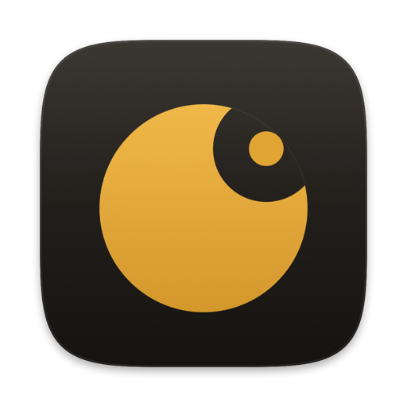
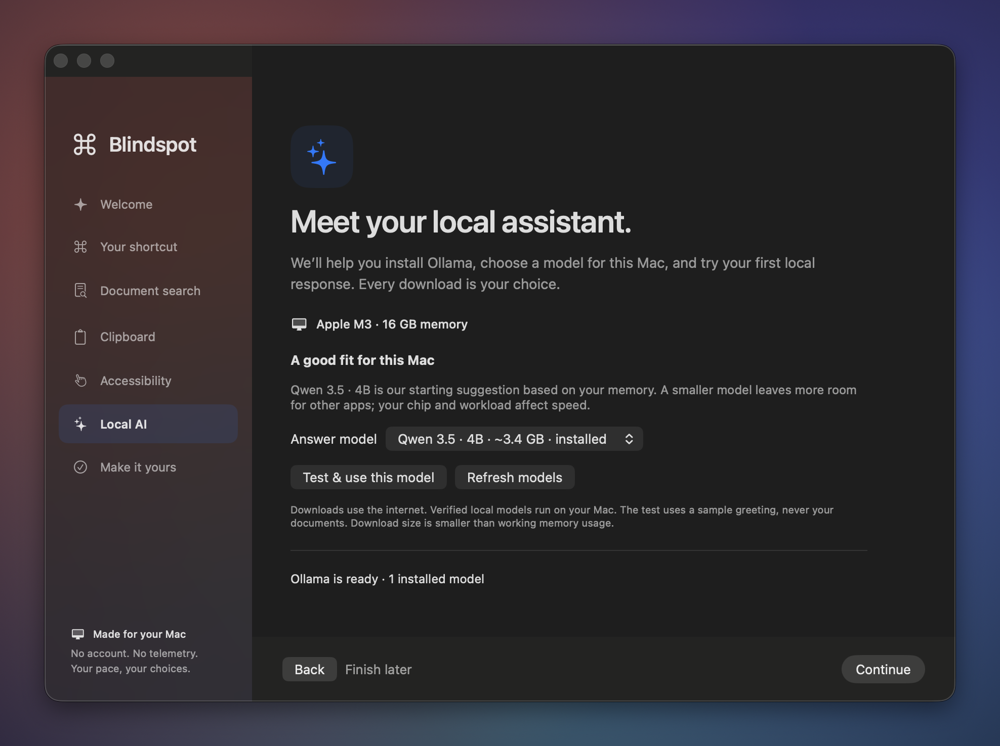
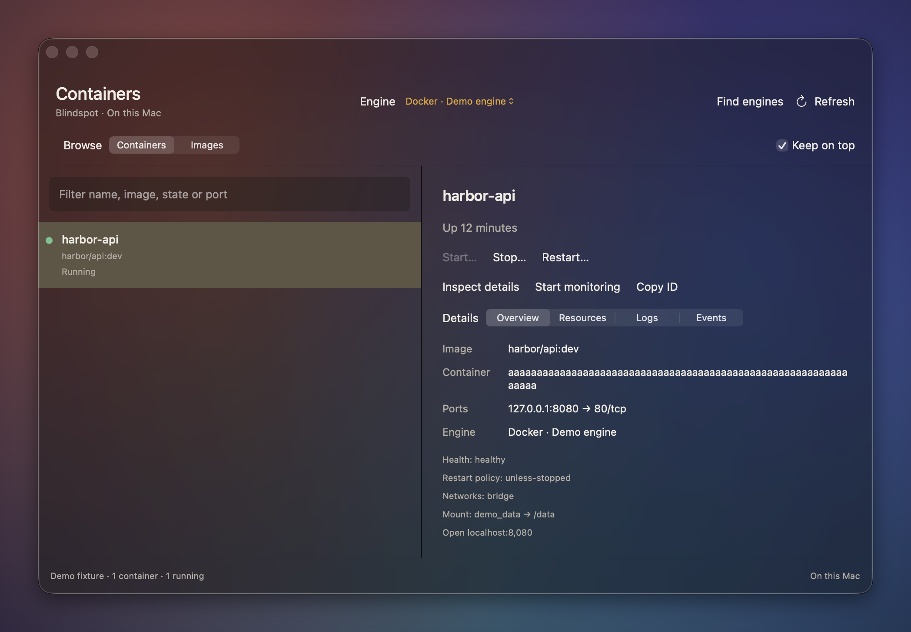
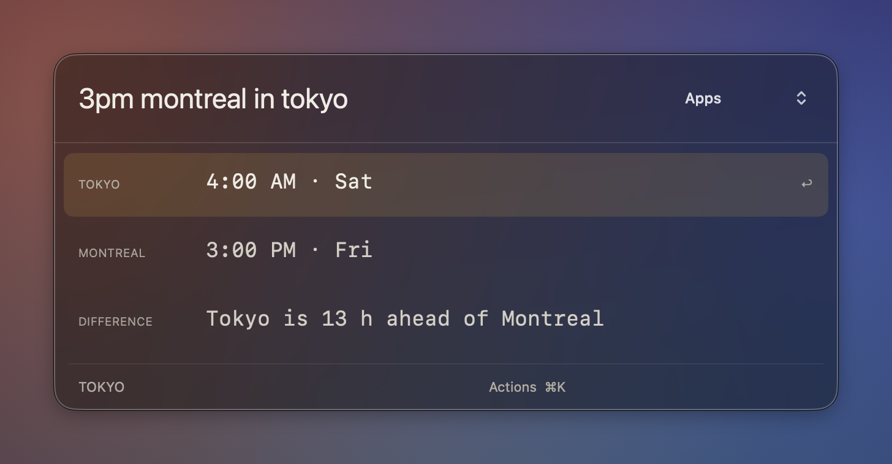
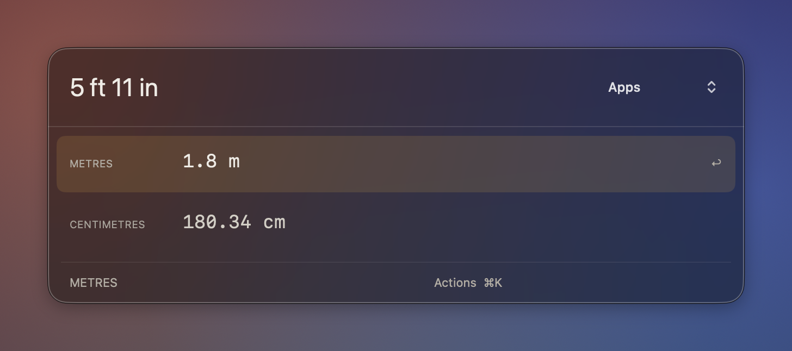

<p align="center"></p>

# Blindspot

**A keyboard launcher for your Mac that also finds what's inside your files, and keeps everything on your Mac.**

Press **⌘⇧Space**, type a few letters, press **Return**. Open apps, find a PDF by what it says,
paste something you copied an hour ago, join your next meeting, or ask your own documents a
question, or manage your local containers. Search, indexing and AI processing stay on your Mac.

[](https://github.com/SeifBoukerdenna/blindspot/actions/workflows/ci.yml)

## Download

1. Get **Blindspot-x.y.z.zip** from the [latest release](https://github.com/SeifBoukerdenna/blindspot/releases/latest).
2. Unzip it and drag **Blindspot.app** into your Applications folder.
3. Open it. The first time, macOS will say it can't verify the app, because Blindspot isn't
   notarized by Apple. Go to **System Settings → Privacy & Security**, scroll down and click
   **Open Anyway**. You only do this once.

Blindspot needs **macOS 26 (Tahoe) or later on an Apple silicon Mac**. There's no Dock icon:
press **⌘⇧Space** to open it.

The first launch shows a native setup guide. Open an app immediately, or follow the optional
steps for document indexing, clipboard history, Accessibility and local AI. Resume anytime from
**Set up Blindspot…** in the menu bar or **Settings → General**. Put the app in a writable
Applications folder (such as `~/Applications`) to use the built-in updater.

### Updating

Open **Settings → About → Updates** and press **Check for updates**. If there's a newer release,
press **Install**. Blindspot downloads it, checks its checksum and code signature, asks, then
replaces itself and reopens. Your settings, clipboard history and index stay as they are. Blindspot
only contacts GitHub when you press the button.

This README follows the repository code. For a downloaded version, use its bundled
**START-HERE.md** and **FEATURE-GUIDE.md**; the repository may contain newer features.

## What you can do

| Type this | And you get |
|---|---|
| `sl` | Slack, or whatever app you meant. Apps you use often rise to the top |
| `?quarterly report` | Files by name. **⌘Return** shows the file in Finder |
| `documents about trail maintenance` | Notes, PDFs and Word files about trail maintenance, with the matching sentence |
| `>docs what did we decide about signaling?` | An answer from your own documents, with sources you can open |
| `;tracking` | Something you copied earlier, from your clipboard history |
| `fix grammar` | Select text anywhere first, and it comes back corrected (also `make shorter`, `bullet points`…) |
| `my schedule` | Today's and tomorrow's events. Press Return on one to join its Zoom, Meet or Teams call |
| `schedule lunch with Sam friday at noon` | A preview of the event; Return adds it to your calendar |
| `lock`, `sleep`, `dark mode`, `empty trash` | Control your Mac. Anything destructive asks first |
| `:3000` | What's using port 3000, and a safe way to stop it |
| `:containers`, `:docker`, `:podman` | Local containers and images, reviewed creation with .env overrides, monitoring, logs and lifecycle controls |
| `15% * 89`, `72f`, `5 km to miles`, `uuid` | Quick maths, unit conversions and developer utilities |
| `3pm montreal in tokyo`, `time in paris` | Time zones, daylight saving included |
| `ocr` | Select part of the screen and copy the text in it |
| `!sig` | Paste a snippet you saved with `:snippet sig Best regards…` |

Type **:** for recent commands first, or **:help** for the complete catalog. **⌘K** shows more actions for any result, **⌘Y** previews a
file, and **⌘,** opens Settings.

The download includes a short **START-HERE.md** and a complete **FEATURE-GUIDE.md**. Read the
[quick start](docs/quick-start.md) or the full reference here: [docs/new-features.md](docs/new-features.md).

### Your local container workspace

Open **:containers** and choose a Docker or Podman engine. **Images → Create container…**
guides a name, localhost port mapping, `.env` file plus masked overrides, mounts, CPU/memory
limits and restart policy, followed by a review. **Containers** has Overview, Resources, Logs
and Events tabs, confirmed lifecycle controls, and searchable logs with local export.
The glass window stays open when focus changes; **⌘W** closes it. See the
[container guide](docs/new-features.md#local-containers) for runtime requirements and limits.

## Media

See Blindspot in action: app search, document search, conversions and clipboard history,
all from the keyboard. The gallery also covers guided setup and the container workspace.
Captures use fictional demo documents and isolated fixtures, never personal files or workloads.


### Screenshots

Click a screenshot to view it at full size. For still images without animation, open the
[media gallery](media/README.md#screenshots).

| Guided local AI setup | Container workspace |
|---|---|
| [](media/onboarding-ai.png) | [](media/containers.png) |

| Search inside documents | Clipboard history |
|---|---|
| [](media/search-inside-documents.png) | [](media/clipboard-history.png) |
| **Index dashboard** | **Calculator and conversions** |
| [](media/index-dashboard.png) | [](media/calculator.png) |
| **Command catalog** | **System commands** |
| [](media/commands.png) | [](media/system-commands.png) |
| **Time zones** | **Unit conversions** |
| [](media/time-zones.png) | [](media/units.png) |
| **Saved snippets** | **Ask your documents** |
| [](media/snippets.png) | [](media/ask-your-documents.png) |

The document question is answered by a local model from the demo documents, with the numbered
sources it drew on. Dashboard counts describe the small demo fixture.

<details>
<summary>Watch the document-question workflow</summary>

Type a question with `>docs`, press Return, and a local model answers from your documents,
citing the files it used.


</details>

[Full media gallery, original assets and capture instructions →](media/README.md)

## Permissions it may ask for

Blindspot works without any of these and only asks when you use the feature that needs one.

- **Accessibility:** to read text you've selected and to paste snippets for you.
- **Screen Recording:** for copying text from a selected screen area.
- **Calendars:** for `my schedule`.
- **Automation:** to control Finder or System Events, for example `empty trash` or `dark mode`.

## Local AI (optional)

The question-answering and writing features use a model running on your own Mac through
[Ollama](https://ollama.com). Open **Set up Blindspot → Local AI** for installation instructions,
a model suggestion based on your Mac's memory, an explicitly confirmed download, and a local
response test. You can reuse an installed model instead. Setup verifies local model metadata;
cloud-backed models are refused. **Settings → AI** holds advanced choices.
Everything else works without Ollama.

## Privacy

- Indexing, search, clipboard history, calendar and AI all run on your Mac. No accounts, no
  telemetry, no analytics.
- New installs wait for you to choose folders and enable indexing or clipboard capture. Existing
  installs retain their choices. Settings → Index shows
  exactly what's been read and how much disk and CPU it uses.
- Clipboard entries marked concealed, transient or sensitive by their source app are excluded.
  Plain text without those markers cannot reliably be recognized as a password.
- Update checks, model downloads, opening browser links and web searches use the network only
  when requested. Container logs are retained in memory unless you explicitly copy or export them.

## Build it yourself

You'll need Xcode 26, Rust (via [rustup](https://rustup.rs)) and `cbindgen` (`cargo install cbindgen`).

```sh
git clone https://github.com/SeifBoukerdenna/blindspot.git
cd blindspot
make install SIGN_ID=-    # builds, signs ad hoc, installs to ~/Applications and launches it
make test                 # core tests
```

With your own certificate, use `SIGN_ID="Developer ID Application: …"` instead. A stable
signature keeps macOS permissions across rebuilds.

Maintainers publish a release with `scripts/release.sh`; see [docs/releasing.md](docs/releasing.md).
For how it's built, see [docs/architecture.md](docs/architecture.md).

For documentation by topic, see [docs/README.md](docs/README.md). Contributor setup is in
[SETUP.md](SETUP.md); verification and local delivery are in [the agent workflow](docs/agent-workflow.md).
