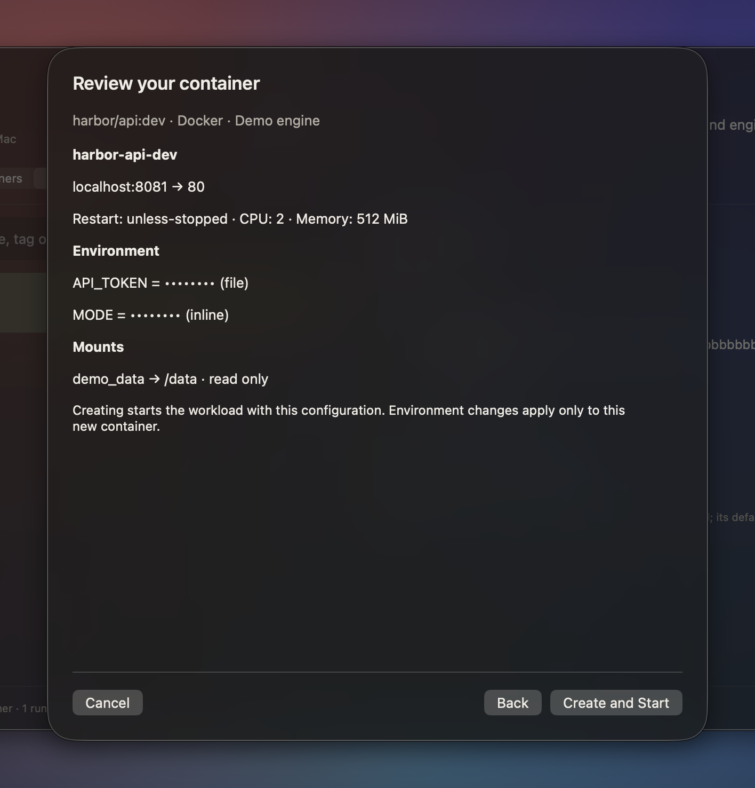
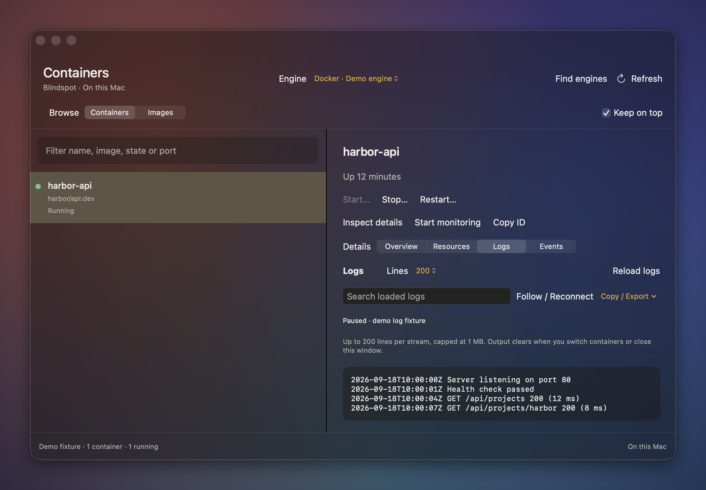

# Blindspot media

Screenshots and recordings of Blindspot's native macOS interface. These captures use
fictional Northwind documents, demo clipboard entries and saved snippets in an isolated
demo home. Refreshed September 18, 2026 from the working tree preparing the 0.3.3 release
(the build version remained 0.3.2). Onboarding and container scenes use synthetic UI fixtures;
they do not query personal configuration or operate on real workloads. The document-answer
scene uses an already installed local Ollama model against the fictional demo index.

[Back to the project](../README.md) · [Feature guide](../docs/new-features.md) ·
[Screenshots](#screenshots) · [Recordings](#recordings) · [Capture new media](#capture-new-media)

## Screenshots

The PNGs below are still images. Click any image to open the original at full resolution.

### Guided local AI setup

The native guide suggests a model from the Mac's memory, offers an installed model or an
explicit download, and provides a local response test. This scene supplies an Apple M3 / 16 GB
hardware fixture and a synthetic connected state; it is not a download or performance measurement.

[](onboarding-ai.png)

### Container workspace

Open `:containers`, `:docker` or `:podman`. The workspace separates local images from container
instances and keeps Overview, Resources, Logs and Events within reach. It stays open until closed;
Keep on top controls stacking. This screenshot's engine, identity and metadata are demo fixtures.

[](containers.png)

### Reviewed container creation

Choose an installed image and configure environment, mounts, resource limits and restart policy.
Review masks values and identifies file versus inline overrides. This synthetic review was
cancelled; no container was created and no runtime was contacted.

[](container-create.png)

### Container logs

Read or follow bounded logs, search loaded output, and copy/export all or filtered output.
Paused/disconnected/truncated status makes gaps explicit. The example below is synthetic paused
output, not evidence of a live connection or completed export.

[](container-logs.png)

### Search inside documents

`documents about northwind` brings matching documents, excerpts and related results into
the launcher.

[](search-inside-documents.png)

### Clipboard history

Type `;` to browse previous copies, then add words to narrow the results.

[](clipboard-history.png)

### Index dashboard

Review indexing state, document categories, included folders and storage. The numbers
shown belong to the small demo fixture; they are not a performance benchmark.

[](index-dashboard.png)

### Calculator and conversions

`1500MB` produces binary, decimal and byte representations that can be copied with Return.

[](calculator.png)

### Time zones

`3pm montreal in tokyo` converts between two places and shows both clocks, with daylight saving
taken from the zone files macOS already keeps. `time in paris` shows the time there.

[](time-zones.png)

### Unit conversions

`5 ft 11 in` answers in the other system. Temperatures, volumes, areas, speeds, pressure, energy,
power, angles, frequencies, data rates and fuel economy convert the same way, and `5 km to miles`
answers in one unit you name.

[](units.png)

### Command catalog

Type `:` for recently invoked commands first, followed by the catalog; `:help` shows the full
registry order. The isolated capture starts with empty command history.

[](commands.png)

### System commands

`:system` lists Mac controls, including operations that require confirmation.

[](system-commands.png)

### Saved snippets

Type `!` to find a saved snippet, or use its name directly, such as `!sig`.

[](snippets.png)

### Ask your documents

`>docs When is the Northwind renewal due?` answered by the local model (`qwen3.5:4b-mlx` through
Ollama) from the demo documents: "October 31, 2026", citing the renewal proposal, with the
retrieved sources listed below the answer. It is one example, not a retrieval-quality benchmark.

[](ask-your-documents.png)

## Recordings

Expand a recording to view its animation, or use the direct GIF link.

<details>
<summary>Launcher workflow — apps, documents, conversions and clipboard</summary>


[Original GIF](launcher.gif)

</details>

<details>
<summary>Document-question workflow — typed question, cited answer</summary>


[Original GIF](ask-your-documents.gif) · [Still image](ask-your-documents.png)

</details>

## Capture new media

The repository includes a capture harness and script:

- [bench/MediaCapture.swift](../bench/MediaCapture.swift) drives the native interface.
- [scripts/capture-media.sh](../scripts/capture-media.sh) prepares fictional documents
  and converts recordings to GIFs.

Run from the repository root:

```sh
make media
```

To retake specific scenes, use `MEDIA_ONLY=onboarding-ai,containers make media`. The `containers`
scene writes overview, logs and creation-review images together. Other scene names match their
asset filenames. This retains existing assets for scenes not selected.

The capture workflow needs Screen Recording permission for the terminal, `ffmpeg`, and
the normal build tools. The AI scene also needs Ollama running with the configured local
model; the script skips that scene if the model is unavailable (and leaves any older asset untouched,
so do not describe it as newly captured). `MEDIA_MODEL` selects an
already installed model, and `MEDIA_OUT` selects an output directory relative to the repo.

The script creates and removes `/Users/Shared/Demo`, and refuses to start if that path
already exists. It blocks Spotlight access for the harness and checks captured result
paths against the demo home. Indexing runs first, outside that sandbox, because the PDF and
Word extraction helper applies its own sandbox, which cannot nest; the capture refuses to start
until text from every demo PDF and Word file is searchable. Keep the mouse and keyboard idle
while capturing; changing focus can dismiss the launcher.

Before replacing these assets, inspect the screenshots and recordings for readable text,
clipped views, private data and the actual outcome shown. Caption failed or unanswered
states accurately. Keep filenames stable so README links continue to work.
